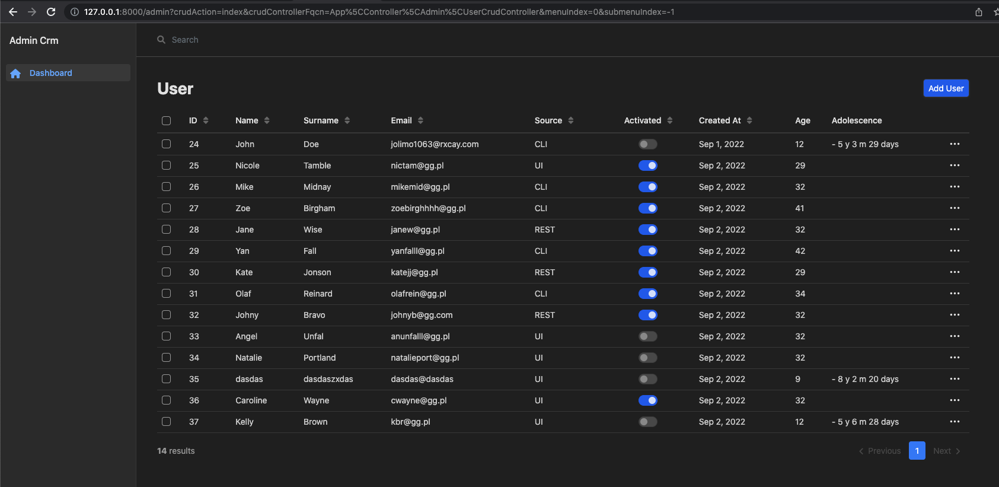
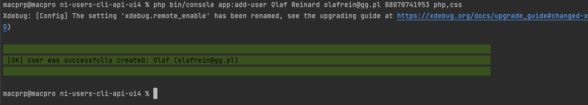
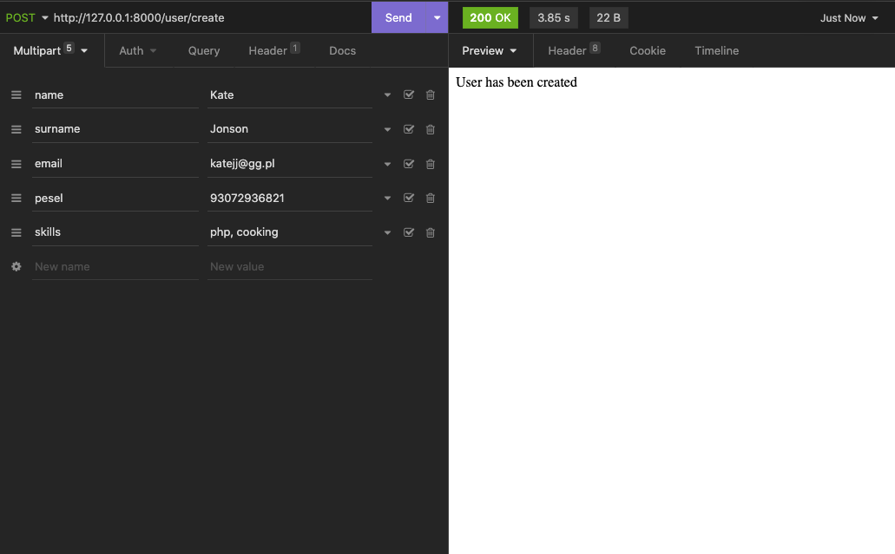

### Guide
This is application that stores users. Users consists of name, surname, email, pesel and set of skills like php, css, html etc...

(img1) Admin panel
______________

(img2) CLI command
______________

(img3) REST request
______________
There are 3 ways of creating new user:
1. CLI 
2. Web http://127.0.0.1:8000/users/add
3. REST API

### Installation
1. You should create new mysql user/password and new mysql database on localhost
2. Find in .env file line with DATABASE_URL=
3. Put this new credentials in this line see documentation (https://symfony.com/doc/current/doctrine.html#configuring-the-database)
4. run commands:
5.     php bin/console make:migration
6.     php bin/console doctrine:migrations:migrate
7. For Web app and REST request, run one more command to display site in browser:
8.     symfony serve

If everything woks ok site should be available at http://127.0.0.1:8000

### CLI

#### 1. Add User
Use this command in terminal in project directory to create user:
    
    php bin/console app:add-user

Or pass parameters with it

    php bin/console app:add-user John Doe johnd@example.com 12345678901 php,css

Skills should be separated by comma ',' ex: 
    
    php, css, java

#### 2. Activate User

For interactive mode use:

    php bin/console app:user-activate

Or pass user identifier as argument:

    php bin/console app:user-activate johnd@gg.pl

For help:

    php bin/console help app:user-activate

### Sending REST request

POST http://127.0.0.1:8000/user/create

Fields list:
    - name
    - surname
    - email 
    - pesel
    - skills

Example request:

Use terminal to execute

    curl -X POST -F 'name=Johny' -F 'surname=Bravo' -F 'email=johnyb@gg.com' -F 'pesel=90030132477' -F 'skills=php,c++,c#' http://127.0.0.1:8000/user/create